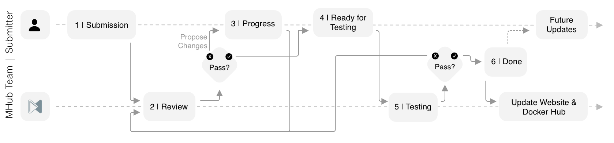

# How to Contribute a Model to MHub

This guide will guide you through the process of preparing a machine learning model for contibution to MHub and the steps to follow to contribute it.

## Before you Contribute

### Who can contribute a model?

We invite everyone to contribute a model to MHub. The contribution process is designed to require minimal effort from the contributor, while saving MHub users a lot of time and effort, providing standardized documentation and an easy-to-use no-code pipeline, and ensuring reproducibility of all MHub models.

If you are a model developer and would like many people to use your model for their work and research, then making your model available in an easy, reproducible and compatible way with MHub is a great idea and will probably not cost you more than a few hours. Believe us, it's worth it!

If you already have experience with a model that you haven't developed yourself but that you find useful for the community (or you just want to simplify your own workflow), you can of course contribute it to MHub. As long as it's open source and meets our general model requirements, you can contribute any third-party model to MHub. If you wish, we will list you as a contributor to the model on the model page.

### What Models can be contributed?

MHub is happy to accept your model or algorithm. However, it must comply with some of our basic concepts, values and requirements. Please read the following carefully before you start preparing your submission.

1. Open Source License

    Your model must be licensed under an open source license. A good choice would be, for example, the [Apache License 2.0](https://www.apache.org/licenses/LICENSE-2.0) or the [MIT License](https://opensource.org/licenses/MIT). However, we can neither help you choose a license model nor offer legal advice.

2. Public GitHub repository

    All your code must be publicly accessible on GitHub.

3. Peer-reviewed publication

    Your model must be published in a peer-reviewed publication. This can be a conference paper, a journal article or a technical report. You can submit a model when a publication is pending, as we explicitly encourage you to mention the reproducible MHub implementation in your publication.

4. Reproducible implementation

    Your model must be implemented in a reproducible way. This means that the code must be executable on a standard computer and deliver the same results as described in the publication. The code must be documented and easy to understand. Make sure you have a minimal, complete list of all dependencies, e.g. a `requirements.txt` or `environment.yml` file. Your code must also not contain any references to hard-coded paths.

5. Technical compatibility

    MHub does not generally restrict the tools used. However, all MHub models must start from our [base Docker image](https://github.com/MHubAI/models/blob/main/base/dockerfiles/Dockerfile) (`mhubai/base:latest`). Therefore, your implementation must be compatible with the version of Ubuntu (we currently use 20.04) and Python (currently 3.8) used in the base image.

If you are not sure whether your model meets these requirements, we recommend that you take a look at our [model repository](https://github.com/MHubAI/models/tree/main/models). There you will find the implementation of all MHub models that you can use as a reference or template for your own submission.

## Submission

To submit a model to MHub you need to create a pull request (PR) to our [models repository](https://github.com/MHubAI/models/pulls).

Start by creating a [fork of our models repository](https://github.com/MHubAI/models/fork). Then clone your fork to your local machine and create a new branch for your model. Create a new folder under `models/models/$model_name` as explained [here](../mhub_models/model_folder_structure.md#model-folder-structure).

Follow the steps outlined in the [MHub Model Structure](../mhub_models/model_folder_structure.md) to prepare your model submission code, metadata and config files.

Then, you can open a PR from your fork to our models repository and apply the `New Model Submission` label to your PR. We will then review your submission and provide feedback. If your submission is not yet ready for review, please create a [draft PR](https://github.blog/2019-02-14-introducing-draft-pull-requests/) instead. Once your feel that your model is ready for review, you can convert your draft PR to a regular PR.

### Submission Timeline

Once you submitted your model to MHub by creating a PR, your submission will go through the following steps.
We have a public board where you can track the progress and current status of your submission. You will also find the status of your submission under the PR.

1. Submission

    Once you submitted your [PR to our models repository](https://github.com/MHubAI/models/pulls) your project is in the submission phase and will be reviewed by our team.

    If **your model is not ready to be reviewed**, please instead create a [draft PR](https://github.blog/2019-02-14-introducing-draft-pull-requests/). Once your feel that your model is ready for review, you can convert your draft PR to a regular PR.

2. Code Review

    We will review your code and provide feedback. Please help us to keep the review process as short as possible by complying with all requirements listed throughout the documentation, reading our documentation and discussion page before asking questions or submitting a model, providing all requested information or information that  might help us reviewing the model and by responding to our comments in a timely manner. If may delay or dismiss reviewing your contribution if not in compliance with the rules layed out above to ensure those submissions that do comply are not delayed.

3. In Progress

    Once we reviewed your code, we might request changes or ask questions about your submissions. Please address all our requested changes  and respond to all our  comments in a timely manner. If we get no response within two weeks we may close your PR. You may reopen it at a later time when you are ready to address our comments.

    If you have considered all comments and changes and your PR can be reviewed again, create a new comment starting with `/review` to request a review by the MHUb team. You can add additional comments after two line breaks or submit a comment that contains nothing but the keyword `/review`.

4. Ready for Testing

    Once your submission satisfies all our requirements and all open issues, questions and comments have been adressed, your submission is ready for testing. Please follow the instructions in the [Testing Phase](../mhub_contribution/testing_phase.md) to prepare your submission for testing and provide us with the requested information.

5. Testing

    Once we received your test results, we will proceed by testing your model on our end ensuring we generate the same results as you did. If we encounter any issues, we will request changes or reply with a comment and place yoursubmission bac into the in progress phase.

6. Done

    If all tests pass, your submission is beeing accepted, your PR is beeing merged, your model will be released on our website under `https://mhub.ai/models/your_model_name` and your model will be available on Docker Hub under `mhubai/your_model_name:latest` after our next build cycle.
