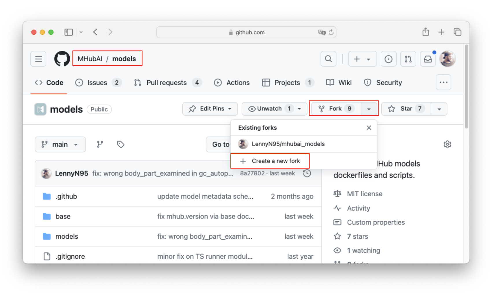

# T3 - Create the Thresholder Model for MHub

- Difficulty: `Beginner`
- Duration: 90 minutes
- Knowledge requirements:
  - Basic knowledge of Python
  - Basic knowledge of Machine Learning

## Introduction

In this tutorial, we will implement a [demo thresholder model](https://github.com/mhubai/thresholder_demo) from scratch in MHub. This is an example of how to implement a segmentation model. There are many ways to implement a model in MHub, and this tutorial will guide you through one way. It is advisable to read through the [documentation](https://github.com/mhubai/documentation) to fully understand the MHub framework. We will link the relevant sections in this tutorial to give you a better orientation.

## Prerequisites

To build and test you model, you need to have a recent version of Docker installed on your system.
To test models which require a GPU or to accelerate the computation for hybrid models, you furthermore need to
have the required drivers and the nvidia toolkit installed on your system.

## Set-Up

We'll start by setting up some environment variables so that you can copy and paste most of the following bash commands without changing them.
You can change the `TUTORIAL_DIR` to any absolute path on your system where we will download the sample data, fork the mhubai/models repository, and build the model implementation. You can change these paths (with the exception of `MODEL_BASE_DIR`) as you wish once you fully understand the structure of the MHub model repository and model implementation.

```bash
# all work will be done in this base directory
TUTORIAL_DIR=$(realpath ~/Desktop/mhub_tutorial_003)

#
MODELS_FORK_REPO="https://github.com/<user/org>/<repo>.git"

# we will clone the MHubAI/models repository here
MODELS_FORK_DIR="$TUTORIAL_DIR/mhub_models"

# we will download test data into the data folder
DATA_DIR="$TUTORIAL_DIR/data"

# unique of our model
MODEL_NAME=demo_th

# directory where model MHub implementation goes
MODEL_BASE_DIR="$MODELS_FORK_DIR/models/$MODEL_NAME"

# the name of the image we will build
DOCKER_IMAGE="mhubai-dev/$MODEL_NAME"
```

## Fork the MhubAI/Models Repository

Every MHub model is stored in a public GitHub repository. The MHub implementation consists of a Dockerfile, one or multiple custom Mhub-IO Modules and one or multiple workflow configurations. For all models of the official MHub repository, these files are defined in the models repository under [https://github.com/mhubai/models](https://github.com/mhubai/models). To start developing a new model, you fork the models repository and clone your fork to your local machine.

### Using the GitHub CLI `gh`

You can use the github cli to fork the repository and clone it to your local machine.
Make sure you have the [GitHub CLI](https://cli.github.com/) installed (or alternatively use the manual procedure described in the next section).
Then you can run the following command.

```bash
gh repo fork mhubai/models --clone $MODELS_FORK_DIR
```

Specify the repository url of your fork in the `MODELS_FORK_REPO` variable.

```bash
MODELS_FORK_REPO="https://github.com/<user/org>/<repo>.git"
```

### Manually from the GitHub Website

Navigate to the official [MHubAI/models](https://github.com/mhubai/models) repository on GitHub and click the "Fork" button in the top right corner. This will create a fork of the repository in your GitHub account. You can then clone the fork to your local machine.



Once you created a fork, you can clone the fork repository to your local machine with the `git clone` commnad.

```bash
git clone $MODELS_FORK_REPO $MODELS_FORK_DIR
```

## Create Model Directory Structure

```bash
# setup test data input and output folders
mkdir -p $DATA_DIR/input
mkdir -p $DATA_DIR/output

# setup mhub model folder structure
mkdir -p $MODEL_BASE_DIR/config 
mkdir -p $MODEL_BASE_DIR/dockerfiles
mkdir -p $MODEL_BASE_DIR/utils
mkdir -p $MODEL_BASE_DIR/src

# setup mhub model file structure
touch $MODEL_BASE_DIR/config/default.yml
touch $MODEL_BASE_DIR/dockerfiles/Dockerfile
touch $MODEL_BASE_DIR/utils/Thresholder.py
```

## Create a New Branch

If you plan to contribute multiple models, it's a good idea to create a new branch for each model (you can only create a single fork from a repository). This way you can keep the changes for each model separate and avoid conflicts when you merge the changes back into the main branch. You could name the branch after the name of the model. Always make sure your fork is up to date with the main repository before creating a new branch by synchronizing the fork with the upstream repository via the sync button on your fork's Github site.

Let's set the working directory to the forked models repository first.

```bash
cd $MODELS_FORK_DIR
```

Now, we can create a new branch for our model named after the model and switch to that branch.

```bash
git branch $MODEL_NAME
git checkout $MODEL_NAME
```

## Test Data

To test our model, we will download three sample dicom series from the IDC database.

```bash
s5cmd --no-sign-request --endpoint-url https://s3.amazonaws.com cp 's3://idc-open-data/8e4ccba1-74f4-4ffa-93f1-2a0263c8c9cf/*' $DATA_DIR/input 

s5cmd --no-sign-request --endpoint-url https://s3.amazonaws.com cp 's3://idc-open-data/7271ab1d-bb03-4ca9-9457-dabcafd4d33f/*' $DATA_DIR/input 

s5cmd --no-sign-request --endpoint-url https://s3.amazonaws.com cp 's3://idc-open-data/5541d783-4c8b-4d1b-8eae-99a868012082/*' $DATA_DIR/input 

echo "Downloaded $(ls $DATA_DIR/input | wc -l) files"
```

## The Dockerfile

We start by writing the *Dockerfile* in which we will set up the entire environment for our model. If you are new to Docker, [this article](https://docs.docker.com/guides/docker-concepts/building-images/writing-a-dockerfile/) can help you get the basics of writing Dockerfiles.
The Dockerfile can be seen as a set of instructions for the entire model environment and should therefore be written as cleanly and structured as possible. The Dockerfile of each MHub model always starts with our `mhubai/base` image, which contains the `mhubio` framework and some additional common libraries, tools and dependencies.

A good way to write your Dockerfile is to open an interactive container from our base image, set up the environment there and at the same time note every step in the Dockerfile.

```bash
# make sure you have the newest version of our base image loaded locally
docker pull mhubai/base:latest

# create a container from our base image and open a bash shell 
docker run --rm -it --entrypoint bash mhubai/base:latest
```

[MHub Dockerfiles](../../documentation/mhub_models/the_mhub_dockerfile.md) should be structured as follows:

1. Start from`mhubai/base` image
2. Install relevant system dependencies
3. Install additional dependencies (e.g. Python packages)
4. Install the model or download the model to the src folder
5. Load the model definition
6. set the entry point

Steps 1, 4, 5 and 6 are required for each model. The other steps are optional, e.g. in some cases you do not need to install additional system libraries and some models install all their dependencies themselves.

The Dockerfile for this demo looks like this:

```Dockerfile
FROM mhubai/base:latest

# install and system lybraries and dependencies
# RUN apt-get update && apt-get install -y --no-install-recommends \
#     <library name> \
# && rm -rf /var/lib/apt/lists/* 

# install any python dependencies 
# RUN uv pip install --no-cache-dir \
#     <package name> 

# install model
RUN uv pip install git+https://github.com/mhubai/thresholder_demo.git

# load model definition
ARG MHUB_MODELS_REPO
RUN buildutils/import_mhub_model.sh demo_th ${MHUB_MODELS_REPO}

# specify entrypoint
ENTRYPOINT ["mhub.run"]
CMD ["--config", "/app/models/demo_th/config/default.yml"]
```

Make sure that you replace the model name (here `demo_th`) with your model name in the following lines:

- `RUN buildutils/import_mhub_model.sh demo_th ${MHUB_MODELS_REPO}`
- `CMD ["--config", "/app/models/demo_th/config/default.yml"]`

### Build the dockerfile

We can now build the Dockerfile to test if the environment is set up correctly and if we can run our model in the container. Note that the MHub implementation is not yet available, because for this we need to either include the model in the MHub models repository or specify a custom models repository (e.g. our fork during development). We will demonstrate this in the next steps.

Always make sure you are using the latest version of our base images by running `docker pull mhubai/base:latest` before creating the Dockerfile.
You can also use the command `docker run --no-cache ...` to prevent the build layers from being cached.

```bash
docker build -t $DOCKER_IMAGE - < $MODEL_BASE_DIR/dockerfiles/Dockerfile
```

If the build was successful, we can spin up another temporary container from the freshly built image and check whether we can run our model.

```bash
docker run --rm -it --gpus all \
  --entrypoint bash \
  -v $DATA_DIR/input:/app/data/input_data:ro \
  $DOCKER_IMAGE
```

Then, inside the container we can test the model by running:

```bash
# create a temporary folder where all nifti files will be stored
mkdir /app/data/nifti

# convert all input dicom files into nifti format
dcm2niix -o /app/data/nifti -f image -z y -b n /app/data/input_data

# only keep one image file 
(cd /app/data/nifti && ls | grep -xv image.nii.gz | xargs rm)

# run the  thresholder demo model on the nifti image file
thresholder -i /app/data/nifti/image.nii.gz -o /app/data/nifti/th.nii.gz -l 200 -u 600

# inspect the output, we should find one image.nii.gz file and a thresholded mask th.nii.gz file.
ls /app/data/nifti
```

If this all works as expected, we have successfully created the environment for our model and confirmed that we can run the model within the environment. However, you will notice that some manual steps are required, such as converting the file format, before we can run the model as our model only accepts nifti data. Also, we have a nifti output file and still need to manually convert it to a dicomseg file. In the next steps, we will wrap our model in an MHub runner and write an MHub workflow so that MHub takes care of importing dicom, converting to nifti, running the model, converting to dicomseg and saving the output.

## The Custom Model Runner Module

We will now write our own MHub-IO module in which we will define the configurable parameters, the input data and the output data of our model. The MHub IO framework takes care of the file organization within the container and ensures that the correct files are made available to our module.

### MHub-IO Imports

We start by importing the required classes from the MHub-IO framework. You can install MHub-IO in your local development environment to get autocompletion and class definitions by running `pip install git+https://github.com/mhubai/mhubio`.
We then start writing the `Thresholder.py` class under the `utils` folder of our model (`$MODEL_BASE_DIR/utils/Thresholder.py`).

```python
from mhubio.core import Module, Instance, InstanceData, IO
```

### Module Definition

Then we define the wrapper class `Thresholder`, which inherits from the class `Module` (like every MHub-IO module).
It is important that the class name is the same as the file name (without the extension `.py`) and that the class inherits from the class `Module`.

```python
class Threshold(Module):
    pass
```

### Define Configurable Parameters

We have two parameters that the user can define in the configuration file and that we will pass on to our model.
The parameter `lower` defines the lower threshold and the parameter `upper` defines the upper threshold. We define these parameters as class variables with the `@IO.Config` decorator.

```python
from mhubio.core import Module, Instance, InstanceData, IO

@IO.Config('lower', int, 0, the='lower threshold')
@IO.Config('upper', int, 0, the='upper threshold')
class Thresholder(Module):
    
    lower: int
    upper: int
```

### Define the Task

The `task(...)` method is where we define the main tasks of our module. This method is automatically called by the MHub-IO framework when the module is executed. To indicate that the method is executed on each instance individually, we decorate the method with the `@IO.Instance()` decorator and add `instance: Instance` to the signature of the task method. Then we define the input and output data of the method with the decorators `@IO.Input` and `@IO.Output`. These decorators retrieve the requested data and provide a parameter for the task function of type `InstanceData`. The `InstanceData` object contains the path to the file in the `.abspath` attribute, which we can use to access the file.

We need an input image in Nifti format with which we can execute our model. The modality should be CT as we are thresholding by Hounsfield units. We can specify this in the `@IO.Input` decorator. The first argument is the parameter name that is passed to the task method. We can call it `image` and put `image: InstanceData` in the signature of the task method. The second argument is the file format of the input data. Here we can specify a [semantic data query (DTQ)](../../documentation/mhubio/semantic_data_queries.md). The DTQ `nifti:mod=ct` will retrieve a nifti file with the modality `ct`. The `the` argument is a human-readable description of the input data.

Since our module outputs a single nifti file, we use the `@IO.Output` decorator to describe the output so that it can be used as input for a subsequent module. The first argument of the decorator is again the name of the parameter that is passed to the task method. We can call it `thresholded` and add `thresholded: InstanceData` to the signature of the task method. The second argument is the path to the output file. We can specify the file name here, e.g., `thresholded.nii.gz`. The third argument is the specification of the data type and the metadata in the MHub format (e.g. `<dtype>:<key>=<value>:<key>=<value>:...`). Note that the metadata is optional and is only used to fetch the data in a later step with a DTQ. Here we use `nifti:mod=seg:model=demo_th:roi=THRESHOLDED` to indicate that the output is a nifti file with the modality `seg` (segmentation) and the model `demo_th` as well as the region of interest `THRESHOLDED`. The `the` argument is a human-readable description of the output data.

*For a complete overview of all `@IO` decorators and the procedure of writing custom MHub-IO modules please refer to the [How to write an MHub-IO module](../../documentation/mhubio/how_to_write_an_mhubio_module.md) article.*

```python
from mhubio.core import Module, Instance, InstanceData, IO

@IO.Config('lower', int, 0, the='lower threshold')
@IO.Config('upper', int, 0, the='upper threshold')
class Thresholder(Module):
    
    lower: int
    upper: int

    @IO.Instance()
    @IO.Input('image', 'nifti:mod=ct',  the='input ct scan')
    @IO.Output('thresholded', 'thresholded.nii.gz', 'nifti:mod=seg:model=demo_th:roi=THRESHOLDED', the='thresholded image')
    def task(self, instance: Instance, image: InstanceData, thresholded: InstanceData) -> None:
        pass

```

### Implement the Task

We now implement the task method. We start by creating the command for the command line interface (CLI) that we will use to run our model. Then we log a debug message with the command we are going to execute. Finally, we execute the command using the `subprocess` method of the `Module` class. Using the `abspath` attribute of the `InstanceData` object, we can access the input and output data, e.g. `image.abspath` and `thresholded.abspath`, and pass them to the thresholder CLI. We also access the configurable parameters `self.lower` and `self.upper` to pass them to the cli. To log data, we can use the `log` attribute of the `Module` class. We can log messages with different levels, e.g. `log`, `captured`, `debug`, `deprecated`, `error`, `external`, `notice`, `warning`.

The implementation of the custom module `Thresholder` is now complete and looks like this.
We will test the module in the next step.

```python
from mhubio.core import Module, Instance, InstanceData, IO

@IO.Config('lower', int, 0, the='lower threshold')
@IO.Config('upper', int, 0, the='upper threshold')
class Thresholder(Module):
    
    lower: int
    upper: int

    @IO.Instance()
    @IO.Input('image', 'nifti:mod=ct',  the='input ct scan')
    @IO.Output('thresholded', 'thresholded.nii.gz', 'nifti:mod=seg:model=demo_th:roi=THRESHOLDED', the='thresholded image')
    def task(self, instance: Instance, image: InstanceData, thresholded: InstanceData) -> None:

        # build cli command for thresholder
        cmd = [
          'thresholder',
          '--input', image.abspath,
          '--output', thresholded.abspath,
          '--lower', str(self.lower),
          '--upper', str(self.upper)
        ]
        
        # debug message
        self.log.debug('Running command: %s', ' '.join(cmd))
        
        # run command
        self.subprocess(cmd)
```

## MHub Test Workflow

To test our module, we need to embed it in an MHub workflow that we can execute inside the container using the MHub-IO framework. If you remember, we used to have to manually specify the paths to the input data and run `dcm2niix` to convert the data and run the model. Now that we have created an MHub-IO module around our thresholder model, we can use the [tools provided by MHub-IO](../../documentation/mhubio/mhubio_modules.md) instead.

First, we import the Dicom data using a [DicomImporter](../../documentation/mhubio/mhubio_modules.md#dicomimporter) module. The DicomImporter module searches for Dicom files and automatically imports each image as a separate instance. We can configure the metadata that is added to each imported Dicom file via the DicomImporter module. We can also use Dicom attributes such as `Modality` by using the `%` prefix, e.g., `%Modality`. This will read the modality of the Dicom image into the `mod` metadata key for each Dicom instance found.

We then convert the data into Nifti format. We use the [NiftiConverter](../../documentation/mhubio/mhubio_modules.md#nifticonverter) for this task. By default, the Nifti converter is applied to data corresponding to the DTQ `dicom|nrrd|mha:mod=ct|mr` (i.e. all data in the format dicom, nrrd or mha with the modality ct or mr). We can set the Nifti converter to run only on `dicom:mod=ct` as we know our data is in dicom format and has modality ct. by default the `NiftiConverter` module uses `plastimatch` to convert files. We can use `dcm2niix` instead by configuring the `engine` accordingly.

Then we run our custom `Thresholder` module. The `lower` and `upper` limits can be set in the configuration file.

Finally, we export the converted image and the thresholded model output to the output folder. To do this, we use the [DataOrganizer](../../documentation/mhubio/mhubio_modules.md#dataorganizer) module and specify two target directives. All files that match the DTQ `nifti:mod=ct` are stored under `[i:sid]/image.nii.gz`, where `[i:sid]` is a placeholder that selects the `sid` (SeriesInstanceUID) attribute from each instance and creates a folder with that name. The second directive saves all files that match `nifti:mod=seg` accordingly under `[i:sid]/th.nii.gz`.

We write the following configuration file `test.yml` and save it under `$MODEL_BASE_DIR/config/test.yml`.

```bash
touch $MODEL_BASE_DIR/config/test.yml
```

The [configuration file](../../documentation/mhubio/the_mhubio_config_file.md) for our test workflow should look like this:

```yaml
general:
  data_base_dir: /app/data
  version: 1.0
  description: "test configuration for demo thresholding model"

execute:
- DicomImporter
# - module: AttributeFilter
#   instance_attributes:
#     sid: 1.2.840.113654.2.55.221581533879834196356530174246594024639
- NiftiConverter
- Thresholder
- DataOrganizer

modules:
  DicomImporter:
    meta: 
      mod: '%Modality'

  NiftiConverter:
    in_datas: dicom:mod=ct
    engine: plastimatch

  Thresholder:
    lower: 200
    upper: 500

  DataOrganizer:
    targets:
      - nifti:mod=ct-->[i:sid]/image.nii.gz
      - nifti:mod=seg-->[i:sid]/th.nii.gz
```

*For a complete overview of all MHub-IO modules refer to the [MHub-IO Modules](../../documentation/mhubio/mhubio_modules.md) article.*
*For a complete overview of the MHub configuration file refer to the [MHub Configuration File](../../documentation/mhubio/the_mhubio_config_file.md) article.*

### Test model in Dockerfile

To run the test workflow created in the previous step, we need to start our container. However, as mentioned above, the custome module and workflow are not yet available in the Docker image. When our model is included in the `mhubai/models` repository, the model definition is loaded into the Dockerfile with the command `RUN buildutils/import_mhub_model.sh ${MHUB_MODEL_NAME} ${MHUB_MODELS_REPO}`. Later, we will commit our changes to our fork and use this fork as a repository for the models. To test our changes before transferring them to a public repository, we can mount the local model directory in the container and run the test workflow from there.

```bash
docker run --rm -it --gpus all \
  --entrypoint mhub.run \
  -v $MODEL_BASE_DIR:/app/models/$MODEL_NAME \
  -v $DATA_DIR/input:/app/data/input_data:ro \
  -v $DATA_DIR/output:/app/data/output_data \
  $DOCKER_IMAGE --cleanup --debug --model $MODEL_NAME --config /app/models/$MODEL_NAME/config/test.yml 
```

## Write the Default dicom to dicom workflow

Each MHub model must have at least one default workflow (`default.yml`) that starts with dicom data and generates a dicom-compatible format.
So we want to convert our thresholded nifti file into a dicomseg file. We can use the DsegConverter module to do this. By default, this module searches for files with `mod=seg:roi=*` and creates a dicomseg file based on the roi defined for the file. To simplify the search for the correct codes and to harmonize the naming and coloring of roi's in all MHub models, we provide a database of reusable segmentations. For example, if a nifti file contains two labels 1, 2 and 3 for the liver and the left and right kidney, you can annotate the metadata as follows: `nifti:roi=LIVER,LEFT_KIDNEY,RIGHT_KIDNEY`, where `LIVER`, `LEFT_KIDNEY` and `RIGHT_KIDNEY` are the IDs of the segmentation in our [SegDB](https://github.com/mhubai/segdb). You can search for matching IDs in the segdb. However, for our demo thresholder holder, there is no entry for `THRESHOLDED` in the SegDB that we defined earlier. We can register a custom segmentation in our custom module instead.

```Python
from segdb.classes.Segment import Segment

# register custom segmentation before class definition
Segment.register("THRESHOLDED", name="Thresholded", color=(255, 0, 0))
```

We can then use the DsegConverter module and update the DataOrganizer module accordingly.
The `default.yml` cnfiguration file should look like this:

```yaml
general:
  data_base_dir: /app/data
  version: 1.0
  description: "default configuration for demo thresholding model"

execute:
- DicomImporter
- NiftiConverter
- Thresholder
- DsegConverter
- DataOrganizer

modules:
  DicomImporter:
    meta: 
      mod: '%Modality'

  Thresholder:
    lower: 200
    upper: 500

  DataOrganizer:
    targets:
      - dicomseg:mod=seg-->[i:sid]/th.seg.dcm
```

## Commit Changes

We can now commit all our changes to our fork and push them to the remote repository.

```bash
# check we're on the model branch 
git branch

# checkout model branch if not already
git checkout $MODEL_NAME

# add changed files to git
git add models/$MODEL_NAME/config/default.yml \
        models/$MODEL_NAME/dockerfiles/Dockerfile \
        models/$MODEL_NAME/utils/Thresholder.py 

# commit the files
git commit -m "model implementation"

# push the changes to the remote repository
git push --set-upstream origin $MODEL_NAME:$MODEL_NAME
```

## Build Model

Our MHub model implementation is now publicly available. We can test our model by building the Docker image and specifying our fork as the models repository.
Once our fork is included in the official [MHubAI/models](https://github.com/mhubai/models) repository, this will happen automatically during the build. You can create a pull request from the model branch of your fork into the official MHubAI/models repository to submit your contribution for review. More information can be found in the [contribution procedure guide](../../documentation/mhub_contribution/contributing_a_model.md). Until then, we can either include local files in the container as described above or specify the argument `--build-arg MHUB_MODELS_REPO=<repo>::<branch>` during the build.

```bash
# make sure MODELS_FORK_REPO is set to the https://github.com/<user/org>/<repo>.git url of your fork
docker build -t $DOCKER_IMAGE --build-arg MHUB_MODELS_REPO=$MODELS_FORK_REPO::$MODEL_NAME $MODELS_FORK_REPO#$MODEL_NAME:models/$MODEL_NAME/dockerfiles
```

You should see the following in the build log:

```text
Importing model definition from MHub models repository.
├── MODEL NAME ..... demo_th
├── REPOSITORY ..... https://github.com/<user/org>/<repo>.git
└── BRANCH ......... demo_th

Warning: the model definition is not from the official MHub Models repository and therefore only suitable for development.
```

## Test Model

Now we can test our model with the standard workflow and the test workflow. We can also create additional workflows to test the model with other configurations or with other data. 

```bash
# run command that automatically launches the default workflow
docker run --rm --gpus all -t \
  -v $DATA_DIR/input:/app/data/input_data:ro \
  -v $DATA_DIR/output:/app/data/output_data \
  $DOCKER_IMAGE

# run in interactive mode, s.t. you can run mhub.run manually in the container shell
docker run --rm --gpus all -it \
  --entrypoint bash \
  -v $DATA_DIR/input:/app/data/input_data:ro \
  -v $DATA_DIR/output:/app/data/output_data \
  $DOCKER_IMAGE
```
