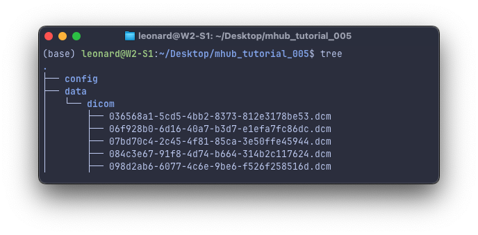
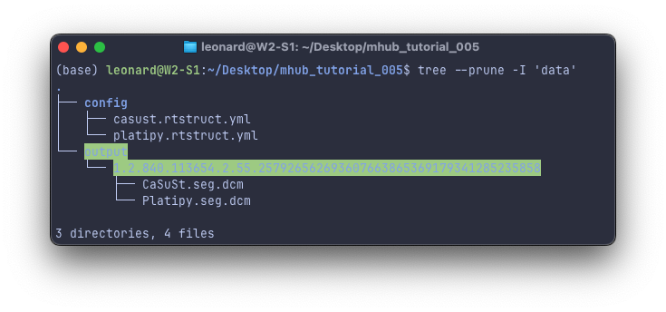
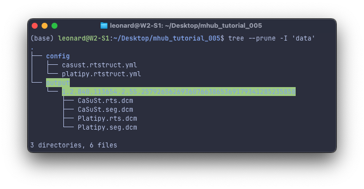

# T5 - Run Heart Structure Segmentations as RTStruct

- Difficulty: `Beginner`
- Duration: 15 minutes
- Knowledge requirements:
  - Basic knowledge of bash commands
  - Basic knowledge of Docker
  - Basic knowledge of YAML

## Introduction

In this tutorial, we will demonstrate how to run a cardiac segmentation model ([Platipy](https:/mhub.ai/models/platipy) or [CaSuSt](https://mhub.ai/models/casust)) using MHub. By default, MHub models generate DICOMSEG files. However, many radiology setups prefer or require RTSTRUCT files. The MHub-IO toolbox includes a complementary RTStructConverter module that generates uniform RTSTRUCT files. You will learn how to update the default configuration file and run the customized model workflow.

## Prerequisites

To build and test your model, you need to have a recent version of Docker installed on your system. A GPU is recommended for running model inference in a reasonable time.

For this tutorial, we will use the sample data included with every MHub model. However, if you have your own DICOM data, you can follow the tutorial using that. If your data is in another format (e.g., NRRD, NIFTI, MHA), check out our tutorial on [Running Custom MHub Lung Segmentation Workflow on Chest CT in NIFTI or NRRD Format](../run_lungmask_on_chestct_in_nifti_format/mhub_tutorial_002.md), where we customize the importer module to work with NIFTI or NRRD data.

## TLDR

For those who just want a quick walkthrough to th esteps to follow along, here's the short version. If you prefer a more detailed guide and some background knowledge, you can jump to [Hands on](#hands-on). Of course you can come here later for a quick recap.

1. Set the folowing environment variables or replace them by absolute paths in all of the below commands.

```bash
export in=$(realpath -m ~/Desktop/mhub_tutorial_005/data)
export out=$(realpath -m ~/Desktop/mhub_tutorial_005/output)
export config=$(realpath -m ~/Desktop/mhub_tutorial_005/config)
```

1. Set up a tutorial folder on your desktop with subdirectories for data input, output, and custom configuration files.

```bash
mkdir -p $in $out $config
```

1. Download the model's sample data for this tutorial.

```bash
docker run --rm -it -v $in:/app/data/input_data --entrypoint mhub.test mhubai/casust:latest vs
```

1. Download the custom config created in this tutorial.

```bash
# for CaSuSt
wget https://raw.githubusercontent.com/MHubAI/documentation/main/tutorials/run_heart_structure_segmentation_as_rtstruct/casust.rtstruct.yml -O $config/casust.rtstruct

# for Platipy
wget https://raw.githubusercontent.com/MHubAI/documentation/main/tutorials/run_heart_structure_segmentation_as_rtstruct/casust.rtstruct.yml -O $config/casust.rtstruct
```

1. Run the custom workflow.

```bash
# for CaSuSt
docker run --rm -t --gpus all -v $in:/app/data/input_data:ro -v $out:/app/data/output_data -v $config/casust.rtstruct.yml:/app/config/custom.yml:ro mhubai/casust:latest --config /app/config/custom.yml

# for Platipy
docker run --rm -t --gpus all -v $in:/app/data/input_data:ro -v $out:/app/data/output_data -v $config/platipy.rtstruct.yml:/app/config/custom.yml:ro mhubai/platipy:latest --config /app/config/custom.yml
```

1. Done, your will find the exported results under the `mhub_tutorial_005/output` folder.

```bash
tree $out
```

## Hands on

In the following sections, we will set up a folder structure, download the sample checst CT scan DICOm data, and create a custom workflow to run the MHub Platipy model on our custom data structure.

### Preparation

Let's create a new folder for this tutorial and set up a folder structure for our input data, output data and custom configuration file. We will create three environment variables that we will use in this tutorial. Instead, you can replace these variables with absolute paths to your files and folders in subsequent commands (but be careful!).

```bash
# navigate to your Desktop (or any other folder on your system you can fully access)
cd ~/Desktop

# create a new folder for this tutorial
mkdir mhub_tutorial_005

# navigate into the new folder
cd mhub_tutorial_005

# create a new folder where we will later store our medical imaging data
mkdir data

# create a new folder where we will later store our model output
mkdir output

# create a new folder where we will later store our MHub configuration file
mkdir config

# we can set our input and output folders absolute paths to the variables
export in=$(realpath ~/Desktop/mhub_tutorial_005/data)
export out=$(realpath ~/Desktop/mhub_tutorial_005/output)
export config=$(realpath ~/Desktop/mhub_tutorial_005/config)
```

### Download Data

If you have data at hand that you would like to use in this tutorial, that's no problem. Please copy your data into the `data/dicom` folder.

Every MHub model includes sample and reference data. The sample data serves as example input, while the reference data represents the expected output for that input. These datasets are used to test the model's reproducibility and also provide examples of input and output for the model.

```bash
# this  will download the sample data into $in/dicom
docker run --rm -it -v $in:/app/data/input_data --entrypoint mhub.test mhubai/platipy:latest vs
```

You will find the sample file in the `data/dicom` folder. You can verify that your folder structure looks like ours by running `tree .` in your terminal. You should see something like this:



### Customizing the MHub Workflow

In this tutorial, we use two cardiac structure delineation models, [Platipy](https://mhub.ai/models/platipy) and [CaSuSt](https://mhub.ai/models/casust), deployed on MHub. However, the customizations you will learn in this tutorial are not specific to these model and can be applied to all MHub segmentation models. You can search our model repository for other models that you find interesting and try them out instead. However, make sure that the data you use is suitable for your chosen model. The example data we downloaded above is a chest CT scan. If you want to use this data, your chosen model should be able to process chest CT scans. You can use the filter options and filter by `Input modality = CT` and `Examined body part = chest` to find all MHub models that meet these requirements.

All MHub models come with a *default workflow*, that runs through a pipeline starting from DICOM data. So if you come to this tutorial with your own data in the dicom folder, you can simply run the default workflow:

```bash
# run the default workflow for the Platipy model
docker run --rm -it --gpus all -v $in:/app/data/input_data:ro -v $out:/app/data/output_data mhubai/platipy:latest

# run the default workflow for the CasuSt model
docker run --rm -it --gpus all -v $in:/app/data/input_data:ro -v $out:/app/data/output_data mhubai/casust:latest
```

After the run completes, you should see the segmentation results in the `output` folder. You can check the output folder by running `tree $out` in your terminal. You should see something like this:


#### Inspection of the Default Workflow

Let's first take a closer look at the default workflow. Each MHub workflow is a single yaml file that describes a sequential execution of so-called MHub Modules. You can learn more about MHub modules and find an overview of all MHub stock modules in our documentation [here](../../documentation/mhubio/mhubio_modules.md).

The default workflow for the MHub deploymnet of Platipy can be found in our [Models Repository](https://github.com/MHubAI/models) under [models/platipy/config/default.yml](https://github.com/MHubAI/models/blob/main/models/platipy/config/default.yml).

```yml
general:
  data_base_dir: /app/data
  version: 1.0.0
  description: default configuration for Platipy (dicom to dicom)

execute:
- DicomImporter
- NiftiConverter
- PlatipyRunner
- DsegConverter
- DataOrganizer

modules:
  DicomImporter:
    source_dir: input_data
    import_dir: sorted_data
    sort_data: true
    meta: 
      mod: '%Modality'

  DsegConverter:
    model_name: Platipy
    body_part_examined: CHEST
    source_segs: nifti:mod=seg
    skip_empty_slices: True

  DataOrganizer:
   targets:
   - dicomseg:mod=seg-->[i:sid]/Platipy.seg.dcm
```

The `general` section contains some general information such as a workflow `description`, the workflow `version` and the base directory `data_base_dir` inside the Docker container, which is usually set to `/app/data`.

Under `execute` you will find a list of Modules that will be executed in sequential order:

1. [DicomImporter](../../documentation/mhubio/mhubio_modules.md#dicomimporter)
2. [NiftiConverter](../../documentation/mhubio/mhubio_modules.md#nifticonverter)
3. PlatipyRunner
4. [DsegConverter](../../documentation/mhubio/mhubio_modules.md#dsegconverter)
5. [DataOrganizer](../../documentation/mhubio/mhubio_modules.md#dataorganizer)

The `PlatipyRunner` is a custom module that runs the platipy heart segmentation model and atlas based registration. You can find the implementation of this module in the Models repository at [models/lungmask/utils/PlatipyRunner.py](https://github.com/MHubAI/models/blob/main/models/platipy/utils/PlatipyRunner.py). All other modules are MHub core modules that are available in every MHub model.

As you can see, this workflow first imports the dicom data. The data is then converted to Nifti in step 2 before being passed on to the PlatipyRunner module, that can actually only process Nifti files as input and similarily generates an output in Nifti format. The output is then converted back to dicom as a DICOMSEG in step 4 and finally organized into the output structure in step 5.

To generate the segmentations as a RTSTRUCT instead of a DICOMSEG, all we need to do is to replace the [DSegConverter](https://github.com/MHubAI/documentation/blob/main/documentation/mhubio/mhubio_modules.md#dsegconverter) with an [RTStructConverter](https://github.com/MHubAI/documentation/blob/main/documentation/mhubio/mhubio_modules.md#dsegconverter).

#### Creating a Custom Workflow

Lets start by creating a new workflow file under `mhub_tutorial_002/config` and name it `platipy.rtstruct.yml`. You can use any text editor you like. We will use `nano` in this tutorial.

```bash
# create the default config file and name it custom.yml
touch $config/platipy.rtstruct.yml

# open the file with nano
nano $config/platipy.rtstruct.yml
```

We perform the following changes:

- we update the `description` to of the workflow
- we replace the `DsegConverter` module with the `RTStructConverter` module in the execute section
- we configure the `RTStructConverter` under `modules` analogeous to the `DsegConverter` module
- we update the `DataOrganizer` module to export the RTStruct instead of the DICOMSEG and change the generated output filename from `Platipy.seg.dcm` to `Platipy.rts.dcm`

```yml
general:
  data_base_dir: /app/data
  version: 1.0.0
  description: custom configuration for Platipy (dicom to rtstruct)

execute:
- DicomImporter
- NiftiConverter
- PlatipyRunner
- RTStructConverter
- DataOrganizer

modules:
  DicomImporter:
    source_dir: input_data
    import_dir: sorted_data
    sort_data: true
    meta: 
      mod: '%Modality'

  RTStructConverter:
    model_name: Platipy
    body_part_examined: CHEST
    source_segs: nifti:mod=seg
    skip_empty_slices: True

  DataOrganizer:
   targets:
   - rtstruct:mod=seg-->[i:sid]/Platipy.rts.dcm
```

#### Running a Custom Workflow

If we run the MHub model now, we first need to make our custom configuration file available inside the container by mounting its absolute path in `/app/config/custom.yml`. We can mount the file read-only: `-v $config:/app/config/custom.yml:ro`. Secondly, we need to specify the custom confg file as the workflow to be executed. Therefore, we specify the `--config` argument for the `mhub.run` script in the container and set it to `/app/config/custom.yml`. Note that the mhub.run script is the default entry point of all MHub models and is automatically executed when the container is started. All arguments passed to the container after the image name (e.g. `mhubai/lungmask:latest`) are therefore passed to the mhub.run script.

```bash
# run the custom workflow for the Platipy model
docker run --rm -t --gpus all -v $in:/app/data/input_data:ro -v $out:/app/data/output_data -v $config/platipy.rtstruct.yml:/app/config/custom.yml:ro mhubai/platipy:latest --config /app/config/custom.yml

# run the custom workflow for the CasuSt model
docker run --rm -t --gpus all -v $in:/app/data/input_data:ro -v $out:/app/data/output_data -v $config/casust.rtstruct.yml:/app/config/custom.yml:ro mhubai/casust:latest --config /app/config/custom.yml
```

After the run completes, you should see the segmentation results in the `output` folder. You can check the output folder by running `tree $out` in your terminal. You should see something like this:



## Where to go from here

- Try to start other models from MHub.
 Filter the models by `Input modality = CT` and `Examined body part = chest` to find other models that you can run with the NLST data downloaded in this tutorial. You can also use the `Segmentation` filter to find models that segment the lungs, heart, etc. You can look under the implementation of each MHub model runner module in the `utils` folder in the [Models Repository](https://github.com/MHubAI/models) to see what input data the model runner module requires, and look in our [core modules](../../documentation/mhubio/mhubio_modules.md) to convert the data into the required format.

- Read more about available MHubIO modules in our [documentation](../../documentation/mhubio/mhubio_modules.md) and how to write your own custom modules in our [documentation](../../documentation/mhubio/how_to_write_an_mhubio_module.md).

- To learn how to run these models directly on NIFTI or NRRD data, follow our tutorial on [Running Custom MHub Lung Segmentation Workflow on Chest CT in NIFTI or NRRD Format](../run_lungmask_on_chestct_in_nifti_format/mhub_tutorial_002.md).
