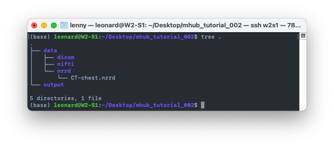
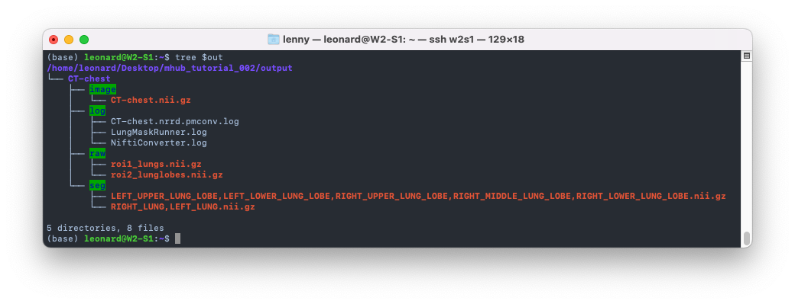

# T2 - Run Custom MHub Lung Segmentation Workflow on Chest CT in Nifti Format

- Difficulty: Intermediate
- Duration: 45 minutes
- Knowledge requirements:  
  minimal knowledge about medical imaging data and the [nifti format](https://nifti.nimh.nih.gov/nifti-1), basic knowledge in using the ubuntu terminal, basic knowledge about Docker, basic knowledge about MHub

## Introduction

In this tutorial you will learn how to create and run a customized MHub workflow to run a lung delineation model "LungMask" deployed on MHub directly on NRRD or NIFTI files. We will download publicly available sample data in this tutorial, however, you're invited to bring your own data instead.

The LungMask [GitHub repository](https://github.com/JoHof/lungmask) and [publication](https://eurradiolexp.springeropen.com/articles/10.1186/s41747-020-00173-2) are publicly available.

## Prerequisites

All MHub models are containerized with Docker, i.e. they are bundled with all dependencies and resources, so you don't need to install anything model-specific. However, you must have Docker installed on your computer. If you have not yet installed Docker, please follow the instructions [here](https://docs.docker.com/get-docker/).

Note that most machine learning algorithms also require an NVIDIA GPU and CUDA. Some models can also run on a CPU, but this can take much longer. The model we use in this tutorial can be run without a GPU, but GPU acceleration is generally recommended.

To download data from IDC, you need to install the [s5cmd download utility](https://github.com/peak/s5cmd). If you want to follow these instructions with your own DICOM image data, you can skip this step.

To swiftly print file tree structures you need to have [tree](https://wiki.ubuntuusers.de/tree/) installed. Try to run `tree --version` in your terminal, we use v1.8.0 in this tutorial. If `tree` is not found, install it with `apt-get install tree`.

To download the sample data we use `wget` (v1.20.3). Try to run `tree --version` in your terminal. If you don't have `wget` installed, you can install it with `apt-get install wget`.

## TLDR

For those who just want a quick walkthrough to th esteps to follow along, here's the short version. If you prefer a more detailed guide and some background knowledge, you can jump to [Hands on](#hands-on). Of course you can come here later for a quick recap.


1. Set the folowing environment variables or replace them by absolute paths in all of the below commands.

  ```bash
  export in=$(realpath -m ~/Desktop/mhub_tutorial_002/data)
  export out=$(realpath -m ~/Desktop/mhub_tutorial_002/output)
  export config=$(realpath -m ~/Desktop/mhub_tutorial_002/config/custom.yml)
  ```

2. Setup a turorial folder under your desktop and create an empty custom config file.
  
  ```bash
  mkdir -p $in $in/nrrd $in/nifti $in/dicom $(dirname $config) && touch $config
  ```

3. Download the sample data for this tutorial.

  ```bash
  wget http://www.slicer.org/w/img_auth.php/3/31/CT-chest.nrrd -O $in/nrrd/CT-chest.nrrd
  ```

4. Download the custom config created in this tutorial.

  ```bash
  wget https://raw.githubusercontent.com/MHubAI/documentation/main/tutorials/run_lungmask_on_chestct_in_nifti_format/custom.yml -O $config
  ```

4. Run the custom workflow.

```bash
docker run --rm -t --gpus all -v $in:/app/data/input_data:ro -v $out:/app/data/output_data -v $config:/app/config/custom.yml:ro mhubai/lungmask:latest --config /app/config/custom.yml
```

5. Done, your will find the exported results under the `mhub_tutorial_002/output` folder.

  ```bash
  tree $out
  ```

## Hands on

In the following sections, we will set up a folder structure, download a chest CT scan in nrrd format, and create a custom workflow to run the MHub LungMask model on our custom data structure. We also configure a custom output structure that contains log files and the original output of the model in nifti format.

### Preparation

Let's create a new folder for this tutorial and set up a folder structure for our input data, output data and custom configuration file. We will create three environment variables that we will use in this tutorial. Instead, you can replace these variables with absolute paths to your files and folders in subsequent commands (but be careful!).

```bash
# navigate to your Desktop (or any other folder on your system you can fully access)
cd ~/Desktop

# create a new folder for this tutorial
mkdir mhub_tutorial_002

# navigate into the new folder
cd mhub_tutorial_002

# create a new folder where we will later store our medical imaging data
mkdir data data/dicom data/nifti data/nrrd

# create a new folder where we will later store our model output
mkdir output

# create a new folder where we will later store our MHub configuration file
mkdir config

# we can set our input and output folders absolute paths to the variables
export in=$(realpath ~/Desktop/mhub_tutorial_002/data)
export out=$(realpath ~/Desktop/mhub_tutorial_002/output)
export config=$(realpath ~/Desktop/mhub_tutorial_002/config)
```

### Download Data

If you have data at hand that you would like to use in this tutorial, that's no problem. Please copy your data into the `data` folder. If your data is in `*.nii.gz`format, copy it to the `mhub_tutorial_002/data/nifti` folder, if your data is in `*.nrrd` format, copy it to the `mhub_tutorial_002/data/nrrd` folder. If your data is in DICOM format, copy it to `mhub_tutorial_002/data/dicom`.

If you don't have data available or if you want to go with public sample data, that's fine too. We will download a chest CT image in `NRRD` format from [http://www.slicer.org/w/img_auth.php/3/31/CT-chest.nrrd](http://www.slicer.org/w/img_auth.php/3/31/CT-chest.nrrd). Please download the file and copy it to `mhub_tutorial_002/data/nrrd`.

```bash
# if you're at a terminal, you can run the followin command to download the sample data
wget http://www.slicer.org/w/img_auth.php/3/31/CT-chest.nrrd -O $in/nrrd
```

You will find the sample file in the `data/nrrd` folder. You can verify that your folder structure looks like ours by running `tree .` in your terminal. You should see something like this:



### Customizing the MHub Workflow

In this tutorial, we use the lung model [LungMask](https://mhub.ai/models/lungmask), lung delineation model deployed on MHub. However, the customizations you will learn in this tutorial are not specific to this model and can also be applied to other MHub models. You can search our model repository for other models that you find interesting and try them out instead. However, make sure that the data you use is suitable for your chosen model. The example data we downloaded above is a chest CT scan. If you want to use this data, your chosen model should be able to process chest CT scans. You can use the filter options and filter by `Input modality = CT` and `Examined body part = chest` to find all MHub models that meet these requirements.

All MHub models come with a *default workflow*, that runs through a pipeline starting from DICOM data. So if you come to this tutorial with your own data in the dicom folder, you can simply run the default workflow:

```bash
# run the default workflow
docker run --rm -i -v $in:/app/data/input_data:ro -v $out:/app/data/output_data mhubai/lungmask:latest
```

Unless you have not provided any Dicom data in the data folder (e.g. in `mhub_tutorial_002/data/dicom`), you will see that MHub imports zero instances (`1. DicomImporter 0/0`) and no output was generated. This is because the default workflow always searches the entire input folder for suitable data in Dicom format.

This has several advantages and is one of the main strengths of MHub, because it allows you to run deep learning models directly on the data of a CT or MRI scanner, without intermediate conversion steps.

But what if you have your data in a format other than dicom, e.g. as nifit or nrrd files?
After all, the TotalSegmentator model we want to apply to our data was trained on data in nifti format and can originally only be applied to a nifti file (and will only produce one or more nifti file outputs). You may be wondering: can you run an MHub model on nifti or nrrd data instead of dicom data? The answer is yes (as long as the model supports it or there is a conversion module in MHub).

However, since there is no workflow for such a specfic task, we have to write our own, which, as you will see in a moment, is very simple and gives you a powerful tool with a high degree of flexibility.

#### Inspection of the Default Workflow

Let's first take a closer look at the standard workflow already mentioned. Each MHub workflow is a single yaml file that describes a sequential execution of so-called MHub Modules. You can learn more about MHub modules and find an overview of all MHub stock modules in our documentation [here](../../documentation/mhubio/mhubio_modules.md).

The default workflow for the MHub deploymnet of LungMask can be found in our [Models Repository](https://github.com/MHubAI/models) under [models/lungmask/config/default.yml](https://github.com/MHubAI/models/blob/main/models/lungmask/config/default.yml).

```yml
general:
  data_base_dir: /app/data
  version: 1.0
  description: Default configuration for LungMask (dicom in, dicom out)

execute:
- DicomImporter
- NiftiConverter
- LungMaskRunner
- DsegConverter
- DataOrganizer

modules:
  DicomImporter:
    source_dir: input_data
    import_dir: sorted_data
    sort_data: True
    meta: 
      mod: `%Modality`

  LungMaskRunner:
    batchsize: 64

  DsegConverter:
    model_name: LungMask
    body_part_examined: CHEST
    source_segs: nifti:mod=seg:roi=*
    skip_empty_slices: True
  
  DataOrganizer:
    targets:
    - dicomseg:mod=seg-->[i:sid]/lungmask.seg.dcm
```

The `general` section contains some general information such as a workflow `description`, the workflow `version` and the base directory `data_base_dir` inside the Docker container, which is usually set to `/app/data`.

Under `execute` you will find a list of Modules that will be executed in sequential order:

1. [DicomImporter](../../documentation/mhubio/mhubio_modules.md#dicomimporter)
2. [NiftiConverter](../../documentation/mhubio/mhubio_modules.md#nifticonverter)
3. LungMaskRunner
4. [DsegConverter](../../documentation/mhubio/mhubio_modules.md#dsegconverter)
5. [DataOrganizer](../../documentation/mhubio/mhubio_modules.md#dataorganizer)

The `LungMaskRunner` is a custom module that runs the lung mask delineation model. You can find the implementation of this module in the Models repository at [models/lungmask/utils/LungMaskRunner.py](https://github.com/MHubAI/models/blob/main/models/lungmask/utils/LungMaskRunner.py). All other modules are MHub core modules that are available in every MHub model.

As you can see, this workflow first imports the dicom data. The data is then converted to Nifti in step 2 before being passed on to the LungMaskRunner module, that can actually only process Nifti files as input and similarily generates an output in Nifti format. The output is then converted back to dicom in step 4 and finally organized in step 5.

To turn this workflow into an nrrd-nifti pipeline, we need to make the following adjustments:

1. We need to replace the `DicomImporter` module with a [FileStructureImporter](../../documentation/mhubio/mhubio_modules.md#filestructureimporter) module that can import data from a file structure.
2. We remove the `DSegConverter` module because DICOMSEG files can only be created for a reference Dicom file.
3. We modify the `DataOrganizer` module to store the raw Nifti output of the lung mask model and to create files with standardized file names thatmake it easier to compare the results of this model with those of other models that delineate the same regions of interest.


#### Creating a Custom Workflow

Lets start by creating a new workflow file under `mhub_tutorial_002/config` and name it `custom.yml`. You can use any text editor you like. We will use `nano` in this tutorial.

```bash
# create the default config file and name it custom.yml
touch $config/custom.yml

# open the file with nano
nano $config/custom.yml
```

Let's start by defining the skeleton of our workflow.
You can copy the following into the newly created file.

```yml
general:
  data_base_dir: /app/data
  version: 1.0
  description: Custom configuration for LungMask (nrrd in, nifti out)

execute:
- FileStructureImporter
- NiftiConverter
- LungMaskRunner
- DataOrganizer

modules:
  LungMaskRunner:
    batchsize: 64
```

We now need to customize these modules  to our specific needs. We start with the customization of the `FileStructureImporter` module.

```yml
modules:
  FileStructureImporter:
    import_id: caseId
    structures:
      - nrrd/re:([\w_-]+).nrrd::$caseId@instance@nrrd:mod=ct
    excludes:
      - nifti/
      - dicom/
```

The above configuration causes the FileStructureImporter to ignore (exclude) the `data/nifti` and `data/dicom` folders. The single directive we specified under the `structures` argument parses the `data/nrrd` folder and then applies a regular expression (`([\w_-]+).nrrd`) to all files it found in this folder. The `$caseId` after the regular expression instructs the FileStructureImporter to store the value extracted from the first group of the regular expression in the caseId metadata field. The `@instance` annotation tells the FileStructureImporter that the file itself should be treated as an instance (e.g., file represents a single patient or study image on which we want to run the lung mask model). The `@nrrd` annotation tells the FileStructureImporter that the file is in nrrd format. The metadata annotation `:mod=ct` is used to describe that the modality of the file is `ct`.

Note that the above configuration can import each nrrd file in the `/data/nrrd` folder as a separate instance and stores the file name in the `caseId` metadata field, which can be accessed later in the DataOrganizer. You can of course customize the regular expression to extract multiple metadata fields from your filenames instead. The FileStructure importer is highly customizable, allowing adaptation to a variety of different file structures and naming conventions.

As mentioned earlier, we don't need to change the NiftiConverter and LungMask runner modules. The NiftiConverter module detects that the FileStructureImporter provides an NRRD file instead of the Dicom file provided by the DicomImporter in the standard workflow and automatically uses the correct tools to immediately convert the NRRD file to Nifti. However, the LungMaskRunner module generates Nifti files as output, so in the next step we want to customize the DataOrganizer module to store the Nifti files in a standardized way.

In the DataOrganizer we can create a list of target statements. Each consists of a query and an output sequence. MHub executes the query based on its internal semantic file structure and exports matching files, creates an output path by replacing the placeholders with file-related values, and exports the file to that path.

First, we want to organize all instance data into separate folders named after the caseId. For each instance, we then want to export all Nifti segmentation files that we can find via the semantic query `nifti:mod=seg`, into a `seg` folder named after their standardized ROI-ID. We also want to export all Nifti files to a `raw` folder with their original names. We're also interested in exporting all the log files in the `log` folder and the converted input image in Nifti format in the `image` folder.

```yml
  DataOrganizer:
    targets:
    - nifti:mod=seg-->[i:caseId]/seg/[d:roi].nii.gz
    - nifti:mod=seg-->[i:caseId]/raw/[basename]
    - log-->[i:caseId]/log/[basename]
    - nifti:mod=ct-->[i:caseId]/image/[basename]
```

The final `custom.yml` config file should then look like below.
You can run `cat $config` to ensure your file looks like ours.

```yml
general:
  data_base_dir: /app/data
  version: 1.0
  description: Custom configuration for LungMask (nrrd in, nifti out)

execute:
- FileStructureImporter
- NiftiConverter
- LungMaskRunner
- DataOrganizer


modules:
  FileStructureImporter:
    import_id: caseId
    structures:
      - nrrd/re:([\w_-]+).nrrd::$caseId@instance@nrrd:mod=ct
    excludes:
      - nifti/
      - dicom/

  LungMaskRunner:
    batchsize: 64

  DataOrganizer:
    targets:
    - nifti:mod=seg-->[i:caseId]/seg/[d:roi].nii.gz
    - nifti:mod=seg-->[i:caseId]/raw/[basename]
    - log-->[i:caseId]/log/[basename]
    - nifti:mod=ct-->[i:caseId]/image/[basename]
```

#### Running a Custom Workflow

If we run the MHub model now, we first need to make our custom configuration file available inside the container by mounting its absolute path in `/app/config/custom.yml`. We can mount the file read-only: `-v $config:/app/config/custom.yml:ro`. Secondly, we need to specify the custom confg file as the workflow to be executed. Therefore, we specify the `--config` argument for the `mhub.run` script in the container and set it to `/app/config/custom.yml`. Note that the mhub.run script is the default entry point of all MHub models and is automatically executed when the container is started. All arguments passed to the container after the image name (e.g. `mhubai/lungmask:latest`) are therefore passed to the mhub.run script.

```bash
# run the custom workflow
docker run --rm -t --gpus all -v $in:/app/data/input_data:ro -v $out:/app/data/output_data -v $config:/app/config/custom.yml:ro mhubai/lungmask:latest --config /app/config/custom.yml
```

After running the above command, MHub imports the `data/nrrd/CT-chest.nrrd` as a single instance, extracts the `caseId=CT-chest` and run the lung mask model on it and saves the output in the `output` folder.



The files in the `output/CT-chest/seg` folder have a name that we specified as `[d:roi]`, which is a placeholder for the default ID of the segmented *Region of Interest* from our segmentation database [SegDB](https://github.com/MHubAI/SegDB/blob/main/segdb/data/segmentations.csv). Because the LungMask model exports Nifti files that contain multiple regions of interest in a single file, MHub exports a comma-separated list.

## Where to go from here

- Try to start other models from MHub.
 Filter the models by `Input modality = CT` and `Examined body part = chest` to find other models that you can run with the NLST data downloaded in this tutorial. You can also use the `Segmentation` filter to find models that segment the lungs, heart, etc. You can look under the implementation of each MHub model runner module in the `utils` folder in the [Models Repository](https://github.com/MHubAI/models) to see what input data the model runner module requires, and look in our [core modules](../../documentation/mhubio/mhubio_modules.md) to convert the data into the required format.

- Read more about the [FileStructureImporter](../../documentation/mhubio/mhubio_modules.md#filestructureimporter) and adapt it to your existing file structure. You can then reuse this customization for multiple models to run MHub on your data without having to change your existing data structure.

- Read more about the [DataOrganizer](../../documentation/mhubio/mhubio_modules.md#dataorganizer) to export additional data and customize the output structure to your needs.
