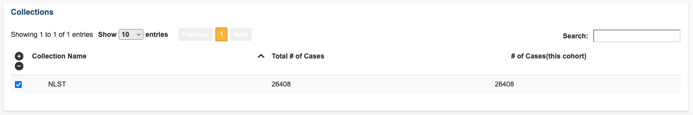
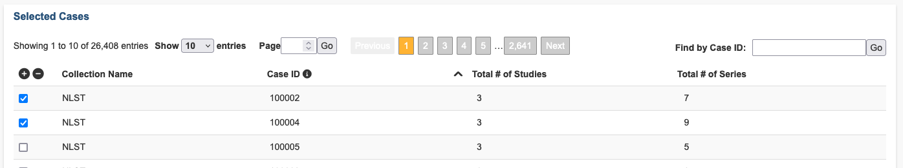
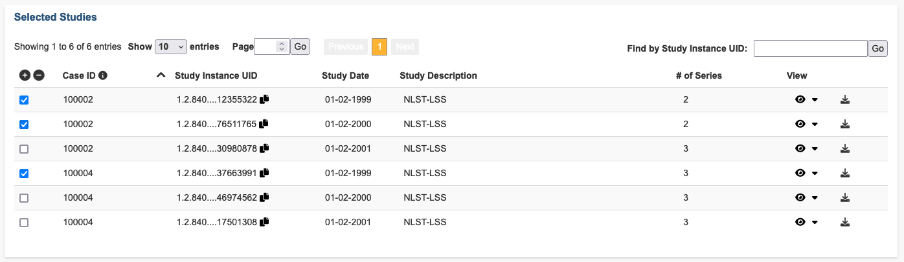
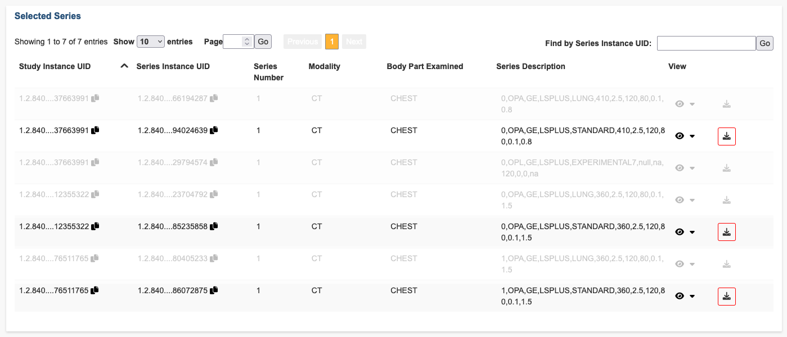
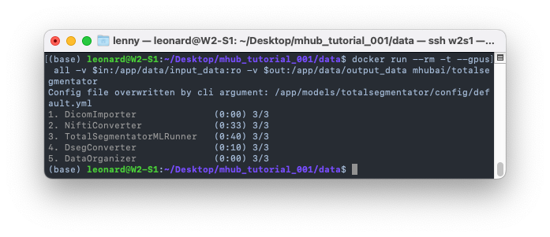
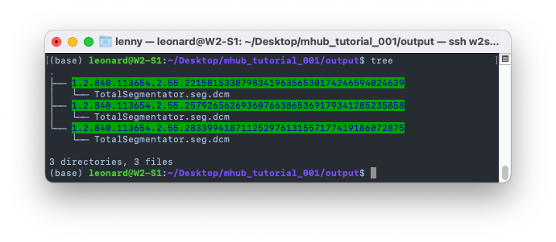
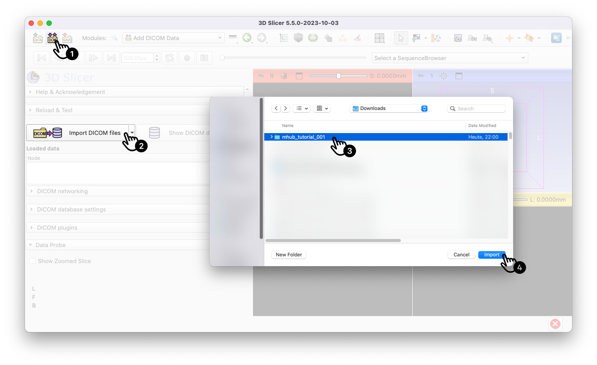
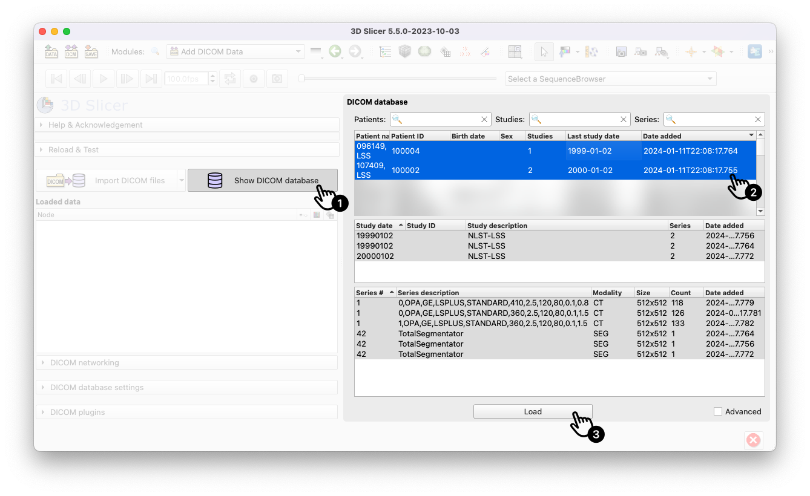
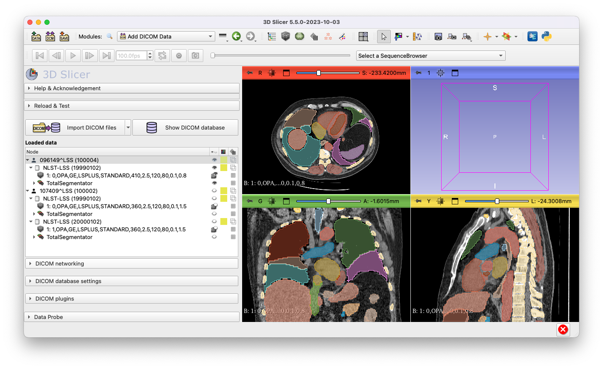

# T1 - Run TotalSegmentator on IDC Collection

- Difficulty: Beginner, Easy
- Duration: 30 minutes
- Knowledge requirements:  
  none, basic knowledge of terminal use and Docker is helpful

## Introduction

In this tutorial you will learn how to use TotalSegmentator on open data from IDC. In general, you will learn how to apply any model available on MHub to data in Dicom format.

## Prerequisites

All MHub models are containerized with Docker, i.e. they are bundled with all dependencies and resources, so you don't need to install anything model-specific. However, you must have Docker installed on your computer. If you have not yet installed Docker, please follow the instructions [here](https://docs.docker.com/get-docker/).

Note that most machine learning algorithms also require an NVIDIA GPU and CUDA. Some models can also run on a CPU, but this can take much longer. The model we use in this tutorial can be run without a GPU, but GPU acceleration is generally recommended.

To download data from IDC, you need to install the [s5cmd download utility](https://github.com/peak/s5cmd). If you want to follow these instructions with your own DICOM image data, you can skip this step.

To swiftly print file tree structures you need to have [tree](https://wiki.ubuntuusers.de/tree/) installed. Try to run `tree --version` in your terminal. If `tree` is not found, install it with `apt-get install tree`.

## TLDR

For those who just want a quick walkthrough to th esteps to follow along, here's the short version. If you prefer a more detailed guide and some background knowledge, you can jump to [Hands on](#hands-on). Of course you can come here later for a quick recap.

1. Set the folowing environment variables or replace them by absolute paths in all of the below commands.

  ```bash
  export in=$(realpath -m ~/Desktop/mhub_tutorial_001/data)
  export out=$(realpath -m ~/Desktop/mhub_tutorial_001/output)
  ```

2. Setup a turorial folder under your desktop.
  
  ```bash
  mkdir -p $in $out
  ```

3. Download public sample data from the [NLST collection](https://portal.imaging.datacommons.cancer.gov/explore/filters/?collection_id=NCI_Trials&collection_id=nlst) from [IDC](https://portal.imaging.datacommons.cancer.gov/explore/).

  ```bash
  s5cmd --no-sign-request --endpoint-url https://s3.amazonaws.com cp 's3://idc-open-data/8e4ccba1-74f4-4ffa-93f1-2a0263c8c9cf/*' $in && s5cmd --no-sign-request --endpoint-url https://s3.amazonaws.com cp 's3://idc-open-data/7271ab1d-bb03-4ca9-9457-dabcafd4d33f/*' $in && s5cmd --no-sign-request --endpoint-url https://s3.amazonaws.com cp 's3://idc-open-data/5541d783-4c8b-4d1b-8eae-99a868012082/*' $in && echo "Downloaded $(ls $in | wc -l) files"
  ```

3. Run the [MHub deployment of TotalSegmentator](http://mhub.ai/models/totalsegmentator) on the downloaded data.

  ```bash
  docker run --rm -t --gpus all -v $in:/app/data/input_data:ro -v $out:/app/data/output_data mhubai/totalsegmentator
  ```

4. Done, your will find the generated segmentation files in the `mhub_tutorial_001/output` folder.

  ```bash
  cd $out && tree .
  ```

## Hands on

Okay, let's get on it. First we need some CT images to run our model on. The Imaging Data Commons has a huge browsable database of publicly available medical images that we will use in this turorial. You will find many different collections containing image data of various modalities (e.g. CT, MR, XRay, etc.) and body parts (e.g. brain, lung, etc.). For this tutorial, we will use the [NLST collection](https://portal.imaging.datacommons.cancer.gov/explore/filters/?collection_id=NCI_Trials&collection_id=nlst). This collection contains all CT exams from the National Lung Screening Trial (NLST), which was conducted to determine whether screening with low-dose CT could reduce mortality from lung cancer for persons at high risk for lung cancer at 33 U.S. medical centers. Participants were randomly assigned to undergo three annual screenings between 2002-2004.

### Preparation

Let's create a new folder for this tutorial.

```bash
# navigate to your Desktop (or any other folder on your system you can fully access)
cd ~/Desktop

# create a new folder for this tutorial
mkdir mhub_tutorial_001

# navigate into the new folder
cd mhub_tutorial_001

# create a new folder where we will later store our medical imaging data
mkdir data

# create a new folder where we will later store our model output
mkdir output
```

### Download Data

First, open the [IDC browser](https://portal.imaging.datacommons.cancer.gov/explore/) and select the NLSR collection.
The following link will take you there directly:

https://portal.imaging.datacommons.cancer.gov/explore/filters/?collection_id=NCI_Trials&collection_id=nlst

Scroll down and select the collection `NLST`.



We then need to select the cases that we want to download. Let's select Case ID `100002` ans `100004`.



Each case can have multiple studies. Let's select the studies with the following unique Study Instance UIDs:
- `1.2.840.113654.2.55.68425808326883186792123057288612355322`
- `1.2.840.113654.2.55.89933508291954731667890414920476511765`
- `1.2.840.113654.2.55.174144834924218414213677353968537663991`

You can use the the *Find by Study Instance UID* search box in the upper right corner to search by the Study Instance UID.



With the above selections we find 7 series in total on IDC. Each series is a individual instance (CT scan in this case). You can use the *eye icon* in the *View* column to open an online viewer and inspect any of the instances. In case you wonder why we have multiple series per study that look almost identical, that is because the images were exported with various kernel settings. Let's for now just select all series with a STANDARD kernel. You can identify those from the *Series Description* column. To download a series, click on the download icon rightmost in the row that will open a popup with the s5cmd command to download the image series. Copy the three commands for now, we will download them together in the next steps.



Now we can download the data. Make sure you're still in the `mhub_tutorial_001` folder we created earlier. Then use the following command to change the working directory to the `data` folder we created earlier.

```bash
# navigate into the data folder
cd data
```

To download the three images for our two NLST sample cases you can now run the following three commands that you collected from the downlaod dialogue on the IDC browser.

```bash
s5cmd --no-sign-request --endpoint-url https://s3.amazonaws.com cp 's3://idc-open-data/8e4ccba1-74f4-4ffa-93f1-2a0263c8c9cf/*' . 

s5cmd --no-sign-request --endpoint-url https://s3.amazonaws.com cp 's3://idc-open-data/7271ab1d-bb03-4ca9-9457-dabcafd4d33f/*' .

s5cmd --no-sign-request --endpoint-url https://s3.amazonaws.com cp 's3://idc-open-data/5541d783-4c8b-4d1b-8eae-99a868012082/*' .
```

You will see that a huge amount of files are downloaded. This is because in dicom each slice of the three-dimensional image is saved as a separate file. You should have downloaded a total of 377 files. You can check this by running `ls | wc -l` in the `data` folder.

You may think that saving images as separate files and putting them in a single folder is not the best way to organize your data. At the file level, you're right, it would take us quite a bit of effort (and the use of external tools) to figure out which file belongs to which image. But we are not lost, because dicom files are incredibly well structured and contain standardized information in their header metadata. MHub is able to read this metadata and automatically organizes the files for you. You can even access this metadata and use it to filter your data and define the output structure of the MHub model, which we will learn in a separate tutorial.

Now with some data downloaded, let's move on to the next step and segment them by running the MHub implementation of *TotalSegmentator* on them.

### Browsing a model

In case you've some experience with AI models, especially in the medical domain, you may expect that we need to install and setup an environment for the model and that we have to organize or convert our data into a specific format as requested by the model.

You will see that when using any MHub deployed model, we don't have to do any og these and can directly run our model on the data. That's because all MHub models are bundled with all their requirements into a single executable container which means zero setup efforts. Furthermore, MHub harmonizes and standardizes the input and output data of all MHub models. If you used the TotalSegmentator, model that we will run in a second, before, you might know that TotalSegmentator takes an input file in the NIFTI format. Usually that means we'd first need to convert our downloaded data, which is currently in DICOM format and that we need to come up with our own data organization strategy. With MHub, however, we can run on TotalSegmentator directly on the dicom data, utilizing the great data organization that dicom already provides.

That beeing said, let's go to the [models page](https://mhub.ai/models) on the MHub website [mhub.ai](https://mhub.ai) and search for the TotalSegmentator model. The following link will take you there directly:

[https://mhub.ai/models/totalsegmentator](https://mhub.ai/models/totalsegmentator)

In addition to detailed information, you will find references to the GitHub repository and the publication of the original model for each model on MHub in a standardized format. On the left-hand side under *Run Model* you will find the command to execute the model. Let's copy the command and take a look at it.

- `docker run ... mhubai/totalsegmentator` downloads the model container from the Docker Hub and executes it
- `--rm` removes the image after the model has run  
  (the container remains on your system and you can remove it with `docker rm mhubai/totalsegmentator`).
- `-t` assignes a pseudo TTY
- `--gpus all` makes the GPU available for the container
- with `-v $in:/app/data/input_data:ro` the folder with the input data on your system is mounted in the container in read-only mode
- with `v $out:/app/data/output_data` the folder with the output data on your system is mounted in the container

You can either replace `$in` and `$out` in the command below with the **absolute paths** (starting with `/`) to the `data` and `output` folders we created earlier and downloaded our data to. Or you can set the paths as environment variables and use them in the command. The latter allows you to run the command without any changes and even run multiple models from MHub without any additional settings or configurations.

```bash
# we can set our input and output folders absolute paths to the variables
export in=$(realpath ~/Desktop/mhub_tutorial_001/data)
export out=$(realpath ~/Desktop/mhub_tutorial_001/output)

# then simply run the command as copied from the MHUb.ai website
docker run --rm -t --gpus all -v $in:/app/data/input_data:ro -v $out:/app/data/output_data mhubai/totalsegmentator
```

You can see that MHub identified and imported 3/3 series in `1. DicomImporter`. The dicom files are then converted into the NIFTI format in `2. NiftiConverter` before they're passed to the deep learning model in step `3. TotalSegmentatorMLRunner`. The nifti file generated by the model is then further converted into a standardized dicomseg file by the `4. DSegConverter` step. Finally, the `5. DataOrganizer` exports the dicomseg file into our output folder.



In our output folder, MHub organizes the files into subfolders by default, one for each series and named after the UID of the series instance. You can customize every aspect by defining your own workflow in a custom config.yml file.



### Visualize the Results

To visualize the results, you can use [3D Slicer](https://www.slicer.org/), a free open source software backed by a great open science community.

Once you have downloaded and installed 3D Slicer, follow the steps on the screenshot below to load the image data and the segmentations into 3D Slicer.



After importing your files, you'll see that Slicer organizes them in the DICOM database.
You may have noticed that the DICOM data looks a little messy in the file system. However, you have seen how easily MHub can derive the decoded structure and produce an ordered output and how Slicer can organize the data in its database, as all the underlying information is stored in the metadata of the Dicom header.

If you open the Dicom database, as shown in the next screenshot, you'll find two entries for the two cases we downloaded. The first case contains one study, the second two studies - exactly as we selected them in the IDC browser. Another advantage of DICOM is that our segmentation results are already linked to the original image data. When you select a case in the DICOM database, you'll find TotalSegmentator's segmentations right next to the image data.



You can follow the steps in the screenshot to load the segmentation results to inspect them.



## Where to go from here

- Try to start other models from MHub.
 Filter the models by `Input modality = CT` and `Examined body part = chest` to find other models that you can run with the NLST data downloaded in this tutorial. You can also use the `Segmentation` filter to find models that segment the lungs, heart, etc. Don't forget to check the model page for the intended use, evaluation results and limitations of the model. Then simply copy the code and run it. The results will be saved in the `output` folder, next to the results of the TotalSegmentator model we ran in this tutorial.

- In the near future, we will create more tutorials explaining how to compare models, how to run models on non-Dicom data, and how to fine-tune the MHub configuration file to customize the inputs and outputs of MHub to your needs.
